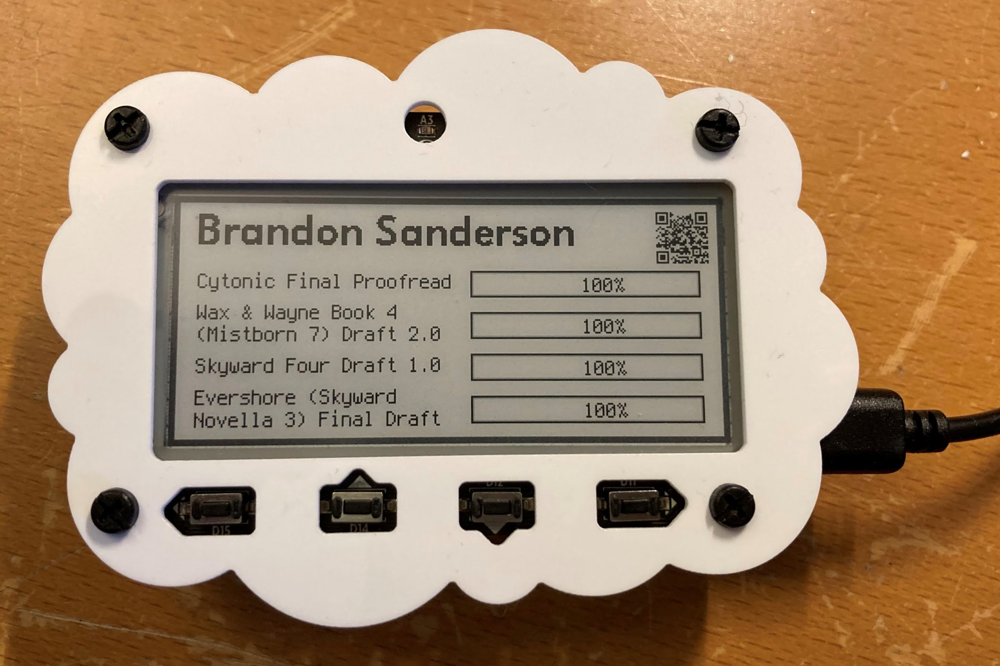

# MagTag - Brandon Sanderson

This project uses the [Adafruit MagTag](https://www.adafruit.com/product/4800) to screen scrape the progress percentages from https://brandonsanderson.com and display them as progress bars.

## Usage
After connecting your MagTag, copy the `code.py` and the `fonts` folder to the MagTag drive that shows up on your computer.